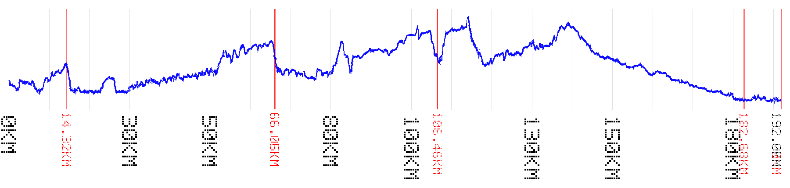

# gpx_to_graph

Small Rust CLI that reads a GPX file and generates a PNG graph for bike navigation.

The graph includes:
- elevation profile over distance (blue curve)
- distance markers every N kilometers (vertical gridlines)
- GPX waypoints as checkpoints on the route (red lines)
- sideways ASCII kilometer labels (font-free, readable on printed strips)
- exact kilometer labels for each checkpoint line
- total route kilometer label on the end border line

## Example output



Example generated from `ff_acp_20_paris_dieppe_2023-16059614-1776064583-488.gpx`.

## Build

```bash
cargo build --release
```

## Run

```bash
cargo run --release -- \
  --input ff_acp_20_paris_dieppe_2023-16059614-1776064583-488.gpx \
  --output route_graph.png \
  --km-step 10 \
  --km-label-step 25 \
  --km-label-scale 5
```

Back-readable printing mode (flip full image left-right):

```bash
cargo run --release -- \
  --input ff_acp_20_paris_dieppe_2023-16059614-1776064583-488.gpx \
  --output route_graph_mirrored.png \
  --mirror
```

Extra readability preset:

```bash
cargo run --release -- \
  --input ff_acp_20_paris_dieppe_2023-16059614-1776064583-488.gpx \
  --output route_graph_readable.png \
  --km-step 5 \
  --km-label-step 30 \
  --km-label-scale 6
```

Optional: keep only specific checkpoints by name:

```bash
cargo run --release -- \
  --input ff_acp_20_paris_dieppe_2023-16059614-1776064583-488.gpx \
  --output route_graph_controls.png \
  --km-step 5 \
  --checkpoint-filter controle
```

## CLI options

- `-i, --input <PATH>`: input GPX file (required)
- `-o, --output <PATH>`: output PNG file (default: `route_graph.png`)
- `--km-step <N>`: kilometer guide line interval (default: `10`)
- `--km-label-step <N>`: kilometer label interval (default: `25`)
- `--km-label-scale <N>`: ASCII bitmap label scale, from `1` to `8` (default: `5`)
- `--mirror`: flip the whole output image horizontally after rendering (for back-readable printing)
- `--checkpoint-filter <TEXT>`: only show waypoints whose names contain this text (case-insensitive)

## Notes

- Checkpoints come from GPX `<wpt>` entries.
- Distance is computed with haversine formula over track points.
- Rendering avoids system font dependencies to prevent `FontUnavailable` errors.
- Image dimensions default to a wide/low profile suitable for printing and rotating.
- Checkpoint and kilometer labels are ASCII bitmap glyphs (no system font required).
