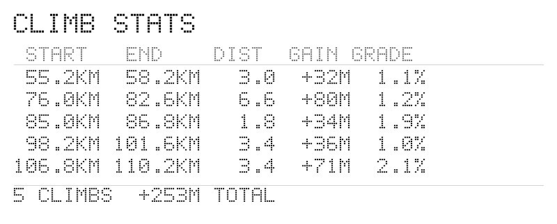

# gpx_to_graph

Small Rust CLI that reads a GPX file and generates a PNG elevation-profile graph for bike navigation.

The output is a wide, low-profile image suitable for printing as a strip (e.g. taped to a handlebar).

## Features

- Elevation profile over distance (filled blue curve with elevation Y-axis)
- Automatic climb detection — major climbs highlighted in orange with gain and average gradient labels
- Configurable distance markers (vertical gridlines every N km)
- GPX waypoints displayed as checkpoints (red lines with km labels)
- Sideways ASCII bitmap labels — no system font dependencies
- Total route distance label on the end border
- Optional horizontal mirror for back-readable printing

## Example output


A separate climb stats image is also generated:



## Build

```bash
cargo build --release
```

## Usage

Basic:

```bash
cargo run --release -- -i route.gpx -o route_graph.png
```

With all options:

```bash
cargo run --release -- \
  -i route.gpx \
  -o route_graph.png \
  --km-step 5 \
  --km-label-step 30 \
  --km-label-scale 6 \
  --mirror \
  --checkpoint-filter controle \
  --climb-min-gain 50
```

## CLI options

| Option | Description | Default |
|---|---|---|
| `-i, --input <PATH>` | Input GPX file | *required* |
| `-o, --output <PATH>` | Output PNG file | `route_graph.png` |
| `--km-step <N>` | Km gridline interval | `10` |
| `--km-label-step <N>` | Km label interval | `25` |
| `--km-label-scale <N>` | Label scale factor (1-8) | `5` |
| `--mirror` | Flip image horizontally | `false` |
| `--checkpoint-filter <TEXT>` | Only show waypoints whose name contains this text (case-insensitive) | *none* |
| `--climb-min-gain <N>` | Minimum elevation gain (meters) to highlight a climb | `30` |
| `--split <N>` | Split output into separate files of N km each | *none* |

## Notes

- Checkpoints come from GPX `<wpt>` entries.
- Distance is computed with the haversine formula over track points.
- Climbs are detected by smoothing the profile (200m resampling) and tracking sustained elevation gains above the threshold. Each climb shows total gain and average gradient.
- All text rendering uses hand-rolled 5x7 ASCII bitmap glyphs — no system fonts required.
